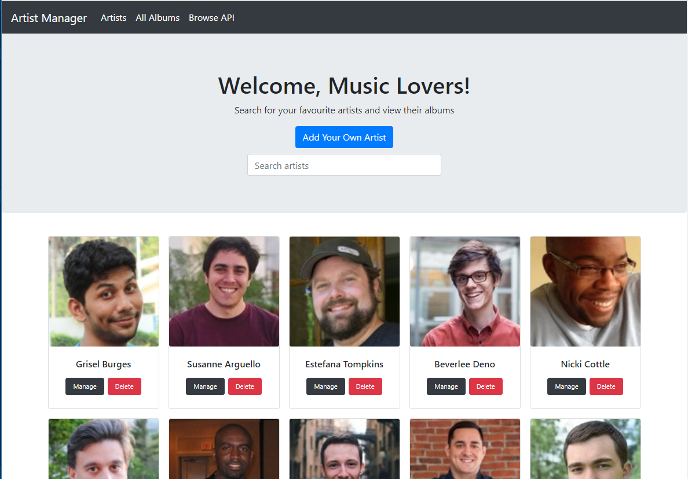
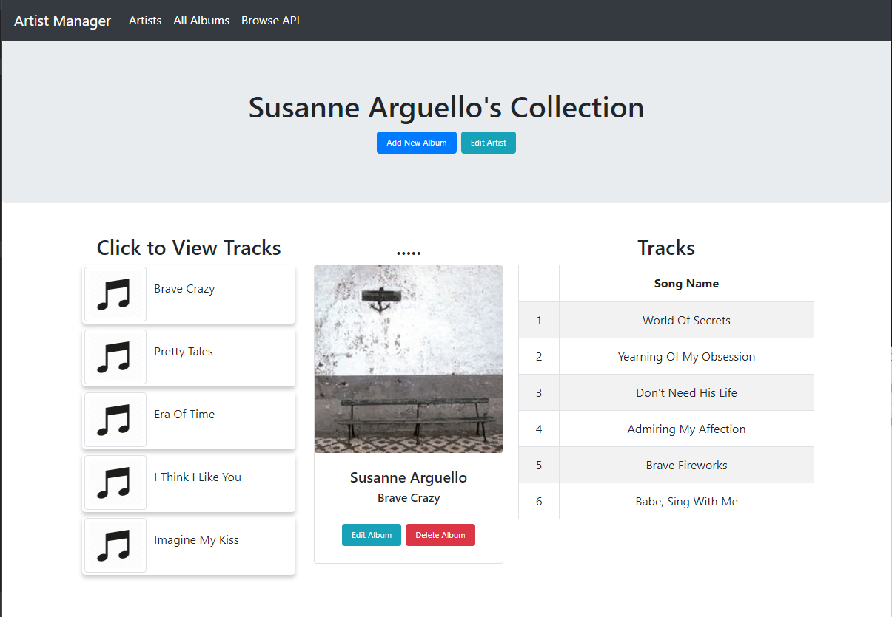

## Artists Management App.

Musanga Challenge Submission.


### Technologies used


| Tech | Use |
| ------------- | ------------- |
| react-router  | For easy routing |
| react-bootstrap  | Nice components for the UI  |
| redux-thunk  | Makes it easy to do http requests with redux  |
| axios  | Has a nice API for http requests  |
| espress  | For the server  |
| mongoose  | Nice API for managing the mongo database |


I got the random names from http://listofrandomnames.com and the pictures from https://randomuser.me/


### Running the Application

To run the app locally, the mongo database from the artistdb folder should be imported into the local database. It contains the seed data. The following steps should be followed after importing the database.

> In the root directory run this code to start the server

```
npm start

```

> Navigate to the react-client directory and run

```
yarn start

```


#### Overview


#### Home Page




#### Management Page


